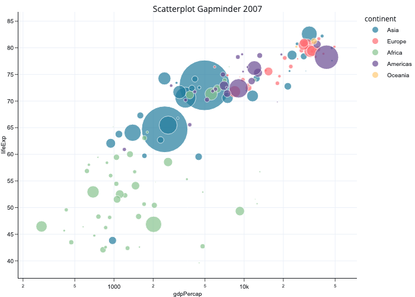

# Morning Coffee

`morning_coffee` is a clean and professional [Plotly template](https://plotly.com/python/templates/).

## Using Morning Coffee

Apply the Morning Coffee template in Plotly Express by setting the template argument:

```python
import plotly.express as px
import morning_coffee

df = px.data.stocks()
fig = px.line(df, x="date", y="GOOG", title="Line chart", template="morning_coffee")
fig.show()
```

Apply the Morning Coffee template a graph objects figure in by setting the template property of the figure's layout:

```python
import plotly.graph_objects as go

fig = go.Figure()
fig.add_scatter(x=df["date"], y=df["GOOG"])
fig.update_layout(template="morning_coffee")
fig.show()
```

It can also be set as the default template:

```python
import plotly.io as pio

pio.templates.default = "plotly_white"
```

## Examples
```python
import plotly.express as px
import morning_coffee
```

#### Line Chart


```python
df = px.data.stocks()
fig = px.line(df, x="date", y="GOOG", title="Line chart", template="morning_coffee")
fig.show()
```


```python
df = px.data.stocks()
fig = px.line(
    df,
    x="date",
    y=df.columns,
    hover_data={"date": "|%B %d, %Y"},
    title="Multiple line charts",
    template="morning_coffee",
)
fig.update_xaxes(dtick="M1", tickformat="%b\n%Y")
fig.show()
```


#### Scatterplots


```python
df = px.data.gapminder().query("year==2007")
fig = px.scatter(
    df,
    x="gdpPercap",
    y="lifeExp",
    size="pop",
    color="continent",
    log_x=True,
    size_max=60,
    title="Scatterplot Gapminder 2007",
    template="morning_coffee",
)
fig.show()
```





```python
df = px.data.iris()
fig = px.scatter(df, x="sepal_width", y="sepal_length", color="species", template="morning_coffee")
fig.update_layout(title="Iris Scatterplot")
fig.show()
```


#### Bar Charts


```python
df = px.data.medals_long()
fig = px.bar(df, x="nation", y="count", color="medal", title="Bar chart", template="morning_coffee")
fig.show()
```


```python
df = px.data.gapminder().query("country == 'Canada'")
fig = px.bar(df, x="year", y="pop", title="Histogram", template="morning_coffee")
fig.show()
```


